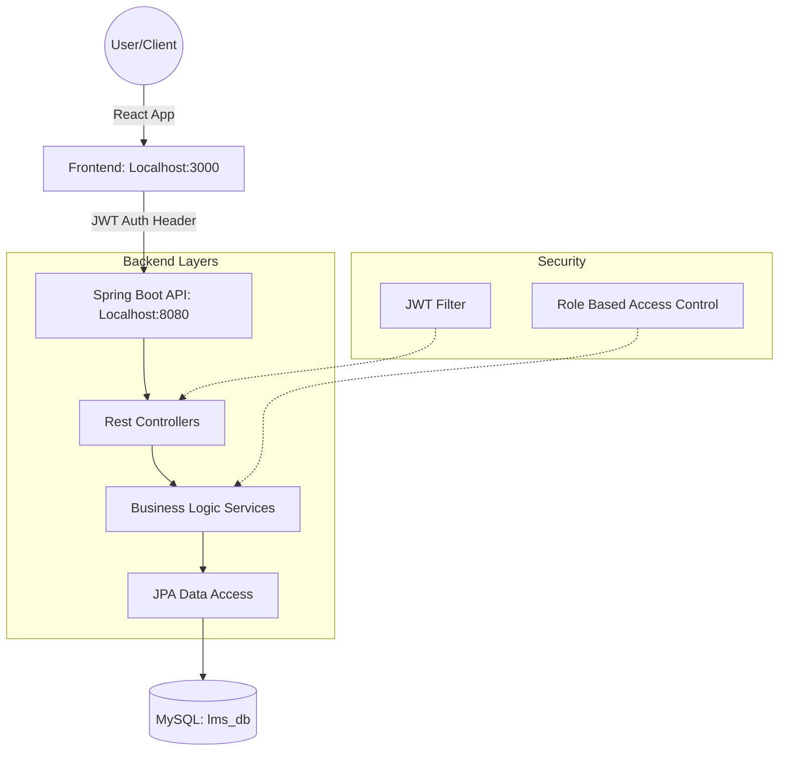
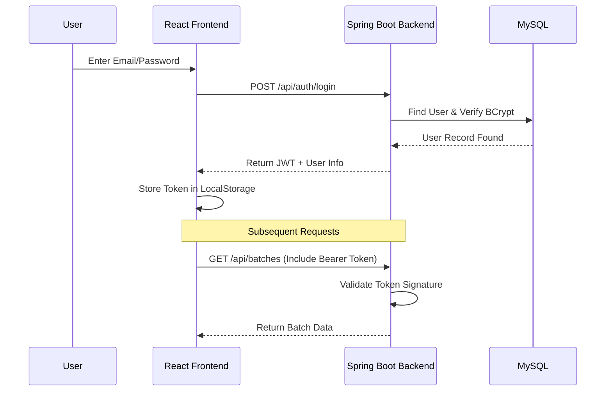
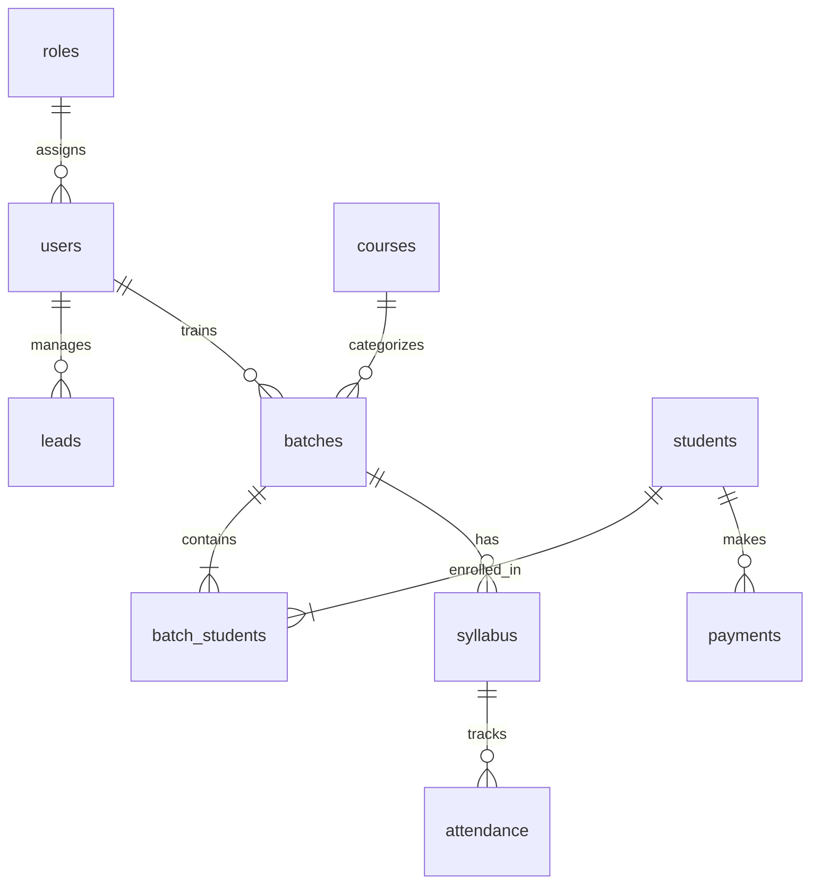

# 🏛️ Institute Management System (LMS) - Architecture

This document outlines the complete architecture, technology stack, and data flow of the IAT LMS.

## 🚀 Technology Stack

| Layer | Technology |
| :--- | :--- |
| **Frontend** | React 18, Vite, CSS3 (Vanilla), Axios, React Router 6 |
| **Backend** | Java 17, Spring Boot 3.2.4, Spring Security, Hibernate/JPA |
| **Database** | MySQL 8.0 |
| **Security** | JWT (Stateless), BCrypt Hashing |
| **Export Tools** | Apache POI (Excel), iText (PDF) |

---

## 🗺️ System Overview

---

## 🔐 Authentication & Security Flow

---

## 👥 Role-Based Access Control (RBAC)

| Module | Admin | Sales Head | Trainer Head | Trainer | Student |
| :--- | :---: | :---: | :---: | :---: | :---: |
| **User Mgmt** | ✅ | ❌ | ❌ | ❌ | ❌ |
| **Leads** | ✅ | ✅ | ❌ | ❌ | ❌ |
| **Batch Creation** | ✅ | ✅ | ✅ | ❌ | ❌ |
| **Enroll Student** | ✅ | ✅ | ✅ | ❌ | ❌ |
| **Gen. Syllabus** | ✅ | ❌ | ✅ | ✅ | ❌ |
| **Syllabus Status**| ✅ | ❌ | ✅ | ✅ | ❌ |
| **Attendance** | ✅ | ❌ | ✅ | ✅ | ❌ |
| **View Dashboard** | ✅ | ✅ | ✅ | ✅ | ✅ |

---

## 📦 Core Business Modules

### 1. Lead Management Lifecycle
**SEO** adds Leads → **Sales Head** assigns to **Sales Employee** → **Student** is created upon payment.

### 2. Academic Module
**Courses** define the curriculum → **Batches** are instances of courses with a **Trainer** → **Syllabus** is auto-generated based on batch start/end dates.

### 3. Student Hub
Students track their **Attendance**, pay **Fees** (in installments), raise **Queries**, and view **Placement** opportunities.

---

## 🗄️ Database Schema Relationships

